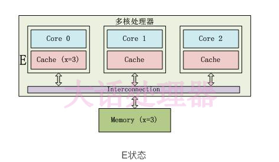
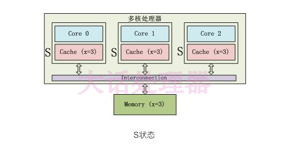
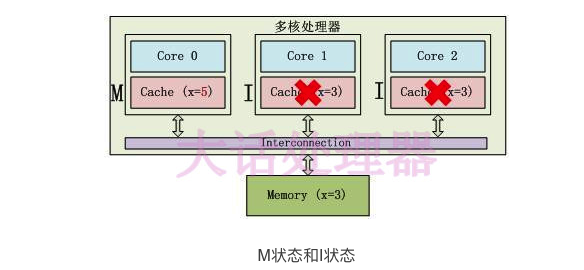

# volatile

> 参考
>
> 《深入理解Java虚拟机》和https://www.infoq.cn/article/ftf-java-volatile

## 1.操作系统语意

计算机在运行程序时，每条指令都是在 CPU 中执行的，在执行过程中势必会涉及到数据的读写。我们知道程序运行的数据是存储在主存中，这时就会有一个问题，读写主存中的数据没有 CPU 中执行指令的速度快，如果任何的交互都需要与主存打交道则会大大影响效率，所以就有了 CPU 高速缓存。CPU高速缓存为某个CPU独有，只与在该CPU运行的线程有关。

有了 CPU 高速缓存虽然解决了效率问题，但是它会带来一个新的问题：数据一致性。在程序运行中，会将运行所需要的数据复制一份到 CPU 高速缓存中，在进行运算时 CPU 不再也主存打交道，而是直接从高速缓存中读写数据，只有当运行结束后，才会将数据刷新到主存中。举一个简单的例子：

```
i = i + 1;
```

当线程运行这段代码时，首先会从主存中读取 i 的值( 假设此时 i = 1 )，然后复制一份到 CPU 高速缓存中，然后 CPU 执行 + 1 的操作（此时 i = 2），然后将数据 i = 2 写入到告诉缓存中，最后刷新到主存中。

其实这样做在单线程中是没有问题的，有问题的是在多线程中。如下：

假如有两个线程 A、B 都执行这个操作（ i++ ），按照我们正常的逻辑思维主存中的i值应该=3 。但事实是这样么？分析如下：

两个线程从主存中读取 i 的值( 假设此时 i = 1 )，到各自的高速缓存中，然后线程 A 执行 +1 操作并将结果写入高速缓存中，最后写入主存中，此时主存 i = 2 。线程B做同样的操作，主存中的 i 仍然 =2 。所以最终结果为 2 并不是 3 。这种现象就是缓存一致性问题。

解决缓存一致性方案有两种：

1. 通过在总线加 LOCK# 锁的方式, 第一种方案， 存在一个问题，它是采用一种独占的方式来实现的，即总线加 LOCK# 锁的话，只能有一个 CPU 能够运行，其他 CPU 都得阻塞，效率较为低下。
2. 通过缓存一致性协议（MESI 协议）, 第二种方案，缓存一致性协议（MESI 协议），它确保每个缓存中使用的共享变量的副本是一致的。其核心思想如下：当某个 CPU 在写数据时，如果发现操作的变量是共享变量，则会通知其他 CPU 告知该变量的缓存行是无效的，因此其他 CPU 在读取该变量时，发现其无效会重新从主存中加载数据。


## 2.Java内存模型

### 2.1.原子性

>原子性：即一个操作或者多个操作，要么全部执行并且执行的过程不会被任何因素打断，要么就都不执行。

原子性就像数据库里面的事务一样，他们是一个团队，同生共死。其实理解原子性非常简单，我们看下面一个简单的例子即可：

```
i = 0;  // <1>
j = i ;  // <2>
i++;  // <3>
i = j + 1; // <4>
```

上面四个操作，有哪个几个是原子操作，那几个不是？如果不是很理解，可能会认为都是原子性操作，其实只有 1 才是原子操作，其余均不是。


上面四个操作，有哪个几个是原子操作，那几个不是？如果不是很理解，可能会认为都是原子性操作，其实只有 1 才是原子操作，其余均不是。

```
<1>：在 Java 中，对基本数据类型的变量和赋值操作都是原子性操作。
<2>：包含了两个操作：读取 i，将 i 值赋值给 j 。
<3>：包含了三个操作：读取 i 值、i + 1 、将 +1 结果赋值给 i 。
<4>：同 <3> 一样
```

那么 64 位的 JDK 环境下，对 64 位数据的读写是否是原子的呢？

>17.7. Non-Atomic Treatment of double andlongFor the purposes of the Java programming language memory model, a single write to a non-volatile long or double value is treated as two separate writes: one to each 32-bit half. This can result in a situation where a thread sees the first 32 bits of a 64-bit value from one write, and the second 32 bits from another write.Writes and reads of volatile long and double values are always atomic.Writes to and reads of references are always atomic, regardless of whether they are implemented as 32-bit or 64-bit values.Some implementations may find it convenient to divide a single write action on a 64-bit long or double value into two write actions on adjacent 32-bit values. For efficiency's sake, this behavior is implementation-specific; an implementation of the Java Virtual Machine is free to perform writes to longand double values atomically or in two parts.Implementations of the Java Virtual Machine are encouraged to avoid splitting 64-bit values where possible. Programmers are encouraged to declare shared 64-bit values as volatile or synchronize their programs correctly to avoid possible complications.

* 实现对普通long与double的读写不要求是原子的（但如果实现为原子操作也OK）
* 实现对volatile long与volatile double的读写必须是原子的（没有选择余地）

在实际开发 中， 目前 各种 平 台下 的 商用 虚拟 机 几乎 都 选择 把 64 位 数据 的 读写 操作 作为 原子 操作 来 对待， 因此 我们 在编 写 代码 时 一般 不需 要把 用到 的 long 和 double 变量 专门 声明 为 volatile。

### 2.2.可见性

>可见性是指当多个线程访问同一个变量时，一个线程修改了这个变量的值，其他线程能够立即看得到修改的值。

在上面已经分析了，在多线程环境下，一个线程对共享变量的操作对其他线程是不可见的。

Java提供了 volatile 来保证可见性。

当一个变量被 volatile 修饰后，表示着线程本地内存无效。当一个线程修改共享变量后他会立即被更新到主内存中；当其他线程读取共享变量时，它会直接从主内存中读取。

当然，synchronize 和锁都可以保证可见性。

### 2.3.有序性

>有序性：即程序执行的顺序按照代码的先后顺序执行。

在 Java 内存模型中，为了效率是允许编译器和处理器对指令进行重排序，当然重排序它不会影响单线程的运行结果，但是对多线程会有影响。

Java 提供 volatile 来保证一定的有序性。最著名的例子就是单例模式里面的 DCL（双重检查锁）。这里 LZ 就先不阐述了，后续会有专门的文章分享。

## 2.剖析volatile原理

>volatile 可以保证线程可见性且提供了一定的有序性，但是无法保证原子性。在 JVM 底层，volatile 是采用“内存屏障”来实现的。

上面那段话，有两层语义：

* 保证可见性、不保证原子性
* 禁止指令重排序

第一层语义就不做介绍了，下面重点介绍指令重排序。

在执行程序时为了提高性能，编译器和处理器通常会对指令做重排序：

* 编译器重排序。编译器在不改变单线程程序语义的前提下，可以重新安排语句的执行顺序。
* 处理器重排序。如果不存在数据依赖性，处理器可以改变语句对应机器指令的执行顺序。

指令重排序对单线程没有什么影响，他不会影响程序的运行结果，但是会影响多线程的正确性。既然指令重排序会影响到多线程执行的正确性，那么我们就需要禁止重排序。那么JVM是如何禁止重排序的呢?

我们着重看第三点 Volatile规则：对 volatile变量的写操作，happen-before 后续的读操作。为了实现 volatile 内存语义，JMM会重排序，其规则如下：


当第二个操作是 volatile 写操作时，不管第一个操作是什么，都不能重排序。这个规则，确保 volatile 写操作之前的操作，都不会被编译器重排序到 volatile 写操作之后

对 happen-before 原则有了稍微的了解，我们再来回答这个问题 JVM 是如何禁止重排序的？

观察加入 volatile 关键字和没有加入 volatile 关键字时所生成的汇编代码发现，加入volatile 关键字时，会多出一个 lock 前缀指令。lock 前缀指令，其实就相当于一个内存屏障。内存屏障是一组处理指令，用来实现对内存操作的顺序限制。volatile 的底层就是通过内存屏障来实现的。下图是完成上述规则所需要的内存屏障：


上面的描述仍然不太容易理解，我们还是继续通过一个例子来看看为何指令重排序会干扰程序的并发执行，演示程序如代码清单所示。


代码清单 12-4 中的程序是一段伪代码，其中描述的场景十分常见，只是我们在处理配置文件时一般不会出现并发而已。如果定义 initialized 变量时没有使用 volatile 修饰，就可能会由于指令重排序的优化，导致位于线程 A 中最后一句的代码“initialized-true'，被提前执行（这里虽然使用 Java 作为伪代码，但所指的重排序优化是机器级的优化操作，提前执行是指这句话对应的汇编代码被提前执行），这样在线程 B 中使用配置信息的代码就可能出现错误，而 volatile 关键字则可以避免此类情况的发生.

指令重排序是并发编程中最容易让开发人员产生疑惑的地方，除了上面伪代码的例子之外，笔者再举一个可以实际操作运行的例子来外析 volatile 关键字是如何禁止指令重排序优化的。

代码清单是一段标准的 DCL 单例代码，可以观察加入 volatile 和未加入 volatile 关键字时所生成汇编代码的差别


**Volatile 屏蔽指令重排序的语义在 JDK1.5 中才被完全修复，此前的 JDK 中即使将变量声明为 volatile 也仍然不能完全避免重排序所导致的问题（主要是 volatile 变量前后的代码仍然存在重排序问题），这点也是在 JDK 1.5 之前的 Java 中无法安全地使用 DCL（双锁检测）来实现单例模式的原因**。

在给Singleton对象初始化的过程中，jvm做了下面3件事：

1. 给Singleton对象分配内存:memory = allocate();
2. 调用Singleton构造函数:instance(memory); 
3. 将Singleton对象指向分配的内存空间:此时instance！=null	instance = memory; 

其中由于2、3不存在数据依赖关系，所以2、3步骤可能会重排序

**由于JVM或操作系统的乱序执行，指令2和指令3的执行顺序是不一定的，当执行完指定3后，此时的Singleton对象就已经不在是null的了，但此时指令2不一定已经被执行**。

假设线程1和线程2同时调用getInstance()方法，此时线程1执行完指令1和指令3，线程2抢到了执行权，此时Singleton对象是非空的。

所以线程2拿到了一个尚未初始化的Singleton对象，此时线程2调用这个Singleton就会抛出异常。

具体通过对比就会发现，关键变化在于有 volatile 修饰的变量，赋值后（前面 ```mov%eax, 0x150(%esi）```这句便是赋值操作）多执行了一个```lock addl$0x0, (%esp)``` 操作. 作相当于一个内存屏障（MemoryBarrier 或 MemoryFence，指令重排序时不能把后面的指令重排序到内存屏障之前的位置），只有一个 CPU 访问内存时，并不需要内存屏障；但如果有两个或更多 CPU 访问同一块内存，且其中有一个在观测另一个，就需要内存屏障来保证一致性了。这句指令中的```addl$0x0, (%esp)```（把 ESP 寄存器的值加 0) 显然是一个空操作指令（采用这个空操作而不是空操作指令 nop 是因为 IA32 手册规定 lock 前缀不允许配合 nop 使用），**关键在于 lock 前缀，查询 IA32 手册，它的作用是使得本 CPU 的 Cache 写入了内存。该写入动作也会引起别的 CPU 或者别的内核无效化（Invalidate）其 Cache，这种操作相当于对 Cache 中的变量做了一次前面介绍 Java 内存模式中所说的“store 和 write“操作，所以通过这样一个空操作，可让前面 volatile 变量的修改对其他 CPU 立即可见**

那为何说它禁止指令重排序呢？从硬件架构上讲，指令重排序是指 CPU 采用了允许将多条指令不按程序规定的顺序分开发送给各相应电路单元处理。但并不是说指令任意重排，CPU 需要能正确处理指令依赖情况以保障程序能得出正确的执行结果。

**lock addl $0x0, (%esp）```指令把修改同步到内存时，意味着所有之前的操作都已经执行完成，这样便形成了“指令重排序无法越过内存屏障”的效果。**

在对volatile变量进行写操作，JVM就会向处理器发送一条Lock前缀的指令，将这个变量所在缓存行的数据写回到系统内存。但是就算写回到内存，如果其他处理器缓存的值还是旧的，再执行计算操作就会有问题，所以在多理器下，为了保证各个处理器的缓存是一致的，就会实现缓存一致性协议(MESI)，每个处理器通过嗅探在总线上传播的数据来检查自己缓存的值是不是过期了，当处理器发现自己缓存行对应的内存地址被修改，就会将当前处理器的缓存行设置成无效状态，当处理器要对这个数据进行修改操作的时候，会强制重新从系统内存里把数据读到处理器缓存里。

## 3.操作系统相关补充

### 3.1.什么是缓存行(Cache Line)？

缓存行 (Cache Line) 便是 CPU Cache 中的最小单位，CPU Cache 由若干缓存行组成，一个缓存行的大小通常是 64 字节（这取决于 CPU），并且它有效地引用主内存中的一块地址。一个 Java 的 long 类型是 8 字节，因此在一个缓存行中可以存 8 个 long 类型的变量。


试想一下你正在遍历一个长度为 16 的 long 数组 data[16]，原始数据自然存在于主内存中，访问过程描述如下

访问 data[0]，CPU core 尝试访问 CPU Cache，未命中。
尝试访问主内存，操作系统一次访问的单位是一个 Cache Line 的大小 — 64 字节，这意味着：既从主内存中获取到了 data[0] 的值，同时将 data[0] ~ data[7] 加入到了 CPU Cache 之中，for free~
访问 data[1]~data[7]，CPU core 尝试访问 CPU Cache，命中直接返回。
访问 data[8]，CPU core 尝试访问 CPU Cache，未命中。
尝试访问主内存。重复步骤 2

### 3.2.伪共享

伪共享指的是多个线程同时读写同一个缓存行的不同变量时导致的 CPU 缓存失效。尽管这些变量之间没有任何关系，但由于在主内存中邻近，存在于同一个缓存行之中，它们的相互覆盖会导致频繁的缓存未命中，引发性能下降。伪共享问题难以被定位，如果系统设计者不理解 CPU 缓存架构，甚至永远无法发现 — 原来我的程序还可以更快。


正如图中所述，如果多个线程的变量共享了同一个 CacheLine，任意一方的修改操作都会使得整个 CacheLine 失效（因为 CacheLine 是 CPU 缓存的最小单位），也就意味着，频繁的多线程操作，CPU 缓存将会彻底失效，降级为 CPU core 和主内存的直接交互。

伪共享问题的解决方法便是字节填充。

我们只需要保证不同线程的变量存在于不同的 CacheLine 即可，使用多余的字节来填充可以做点这一点，这样就不会出现伪共享问题。在代码层面如何实现图中的字节填充呢？


### 3.3.MESI

处理器上有一套完整的协议，来保证Cache一致性。比较经典的Cache一致性协议当属MESI协议，奔腾处理器有使用它，很多其他的处理器都是使用它的变种。

单核Cache中每个Cache line有2个标志：dirty和valid标志，它们很好的描述了Cache和Memory(内存)之间的数据关系(数据是否有效，数据是否被修改)，而在多核处理器中，多个核会共享一些数据，MESI协议就包含了描述共享的状态。

在MESI协议中，每个Cache line有4个状态，可用2个bit表示，它们分别是： 

| 状态         | 描述                                                         |
| ------------ | ------------------------------------------------------------ |
| M(Modified)  | 这行数据有效，数据被修改了，和内存中的数据不一致，数据只存在于本Cache中。 |
| E(Exclusive) | 这行数据有效，数据和内存中的数据一致，数据只存在于本Cache中。 |
| S(Shared)    | 这行数据有效，数据和内存中的数据一致，数据存在于很多Cache中。 |
| I(Invalid)   | 这行数据无效。                                               |

E状态示例如下： 只有Core 0访问变量x，它的Cache line状态为E(Exclusive)。



S状态示例如下：3个Core都访问变量x，它们对应的Cache line为S(Shared)状态。



M状态和I状态示例如下：Core 0修改了x的值之后，这个Cache line变成了M(Modified)状态，其他Core对应的Cache line变成了I(Invalid)状态。



在MESI协议中，每个Cache的Cache控制器不仅知道自己的读写操作，而且也监听(snoop)其它Cache的读写操作。每个Cache line所处的状态根据本核和其它核的读写操作在4个状态间进行迁移。


在上图中，Local Read表示本内核读本Cache中的值，Local Write表示本内核写本Cache中的值，Remote Read表示其它内核读其它Cache中的值，Remote Write表示其它内核写其它Cache中的值，箭头表示本Cache line状态的迁移，环形箭头表示状态不变。

当内核需要访问的数据不在本Cache中，而其它Cache有这份数据的备份时，本Cache既可以从内存中导入数据，也可以从其它Cache中导入数据，不同的处理器会有不同的选择。MESI协议为了使自己更加通用，没有定义这些细节，只定义了状态之间的迁移，下面的描述假设本Cache从内存中导入数据。

**注意和volatile区分：一个是缓存一致性，一个是内存一致性。**

#### 失效队列

处理失效的缓存也不是简单的，需要读取主存。并且存储缓存也不是无限大的，那么当存储缓存满的时候，处理器还是要等待失效响应的。为了解决上面两个问题，引进了失效队列（invalidate queue）。处理失效的工作如下：

- 收到失效消息时，放到失效队列中去。
- 为了不让处理器久等失效响应，收到失效消息需要马上回复失效响应。
- 为了不频繁阻塞处理器，不会马上读主存以及设置缓存为invlid，合适的时候再一块处理失效队列。

#### MESI和CAS关系

在x86架构上，CAS被翻译为”lock cmpxchg...“，当两个core同时执行针对同一地址的CAS指令时,其实他们是在试图修改每个core自己持有的Cache line,

假设两个core都持有相同地址对应cacheline,且各自cacheline 状态为S, 这时如果要想成功修改,就首先需要把S转为E或者M, 则需要向其它core invalidate 这个地址的cacheline,则两个core都会向**ring bus**发出 invalidate这个操作, 那么在ringbus上就会根据特定的设计协议仲裁是core0,还是core1能赢得这个invalidate, 胜者完成操作, 失败者需要接受结果, invalidate自己对应的cacheline,再读取胜者修改后的值, 回到起点.

对于我们的CAS操作来说, 其实锁并没有消失,只是转嫁到了ring bus的总线仲裁协议中. 而且大量的多核同时针对一个地址的CAS操作会引起反复的互相invalidate 同一cacheline, 造成pingpong效应, 同样会降低性能。**当然如果真的有性能问题，我觉得这可能会在ns级别体现了,一般的应用程序中使用CAS应该不会引起性能问题**


### 3.4.LOCK前缀

通过查 IA-32 架构软件开发者手册可知，lock 前缀的指令在多核处理器下会引发了两件事情。

- 将当前处理器缓存行的数据会写回到系统内存。
- 这个写回内存的操作会引起在其他 CPU 里缓存了该内存地址的数据无效。

处理器为了提高处理速度，不直接和内存进行通讯，而是先将系统内存的数据读到内部缓存（L1,L2 或其他）后再进行操作，但操作完之后不知道何时会写到内存，如果对声明了 Volatile 变量进行写操作，JVM 就会向处理器发送一条 Lock 前缀的指令，将这个变量所在缓存行的数据写回到系统内存。但是就算写回到内存，如果其他处理器缓存的值还是旧的，再执行计算操作就会有问题，所以在多处理器下，为了保证各个处理器的缓存是一致的，就会实现缓存一致性协议，每个处理器通过嗅探在总线上传播的数据来检查自己缓存的值是不是过期了，当处理器发现自己缓存行对应的内存地址被修改，就会将当前处理器的缓存行设置成无效状态，当处理器要对这个数据进行修改操作的时候，会强制重新从系统内存里把数据读到处理器缓存里。

这两件事情在 IA-32 软件开发者架构手册的第三册的多处理器管理章节（第八章）中有详细阐述。

**Lock 前缀指令会引起处理器缓存回写到内存**。Lock 前缀指令导致在执行指令期间，声言处理器的 LOCK# 信号。在多处理器环境中，LOCK# 信号确保在声言该信号期间，处理器可以独占使用任何共享内存。（因为它会锁住总线，导致其他 CPU 不能访问总线，不能访问总线就意味着不能访问系统内存），但是在最近的处理器里，LOCK＃信号一般不锁总线，而是锁缓存，毕竟锁总线开销比较大。在 8.1.4 章节有详细说明锁定操作对处理器缓存的影响，对于 Intel486 和 Pentium 处理器，在锁操作时，总是在总线上声言 LOCK# 信号。但在 P6 和最近的处理器中，如果访问的内存区域已经缓存在处理器内部，则不会声言 LOCK# 信号。相反地，它会锁定这块内存区域的缓存并回写到内存，并使用缓存一致性机制来确保修改的原子性，此操作被称为“缓存锁定”，**缓存一致性机制会阻止同时修改被两个以上处理器缓存的内存区域数据**。

**一个处理器的缓存回写到内存会导致其他处理器的缓存无效**。IA-32 处理器和 Intel 64 处理器使用 MESI（修改，独占，共享，无效）控制协议去维护内部缓存和其他处理器缓存的一致性。在多核处理器系统中进行操作的时候，IA-32 和 Intel 64 处理器能嗅探其他处理器访问系统内存和它们的内部缓存。它们使用嗅探技术保证它的内部缓存，系统内存和其他处理器的缓存的数据在总线上保持一致。例如在 Pentium 和 P6 family 处理器中，如果通过嗅探一个处理器来检测其他处理器打算写内存地址，而这个地址当前处理共享状态，那么正在嗅探的处理器将无效它的缓存行，在下次访问相同内存地址时，强制执行缓存行填充。

## 4.总结

* volatile作用
  * 防止重排序, 一般实例化一个对象分为3步：
    1. 分配对象内存空间: memory = allocate();
    2. 初始化对象: instance(memory); 
    3. 设置instance指向刚分配的内存地址，此时instance！=null; instance = memory; 
    4. 其中由于2、3不存在数据依赖关系，所以2、3步骤可能会重排序
  * 实现可见性: 解决办法就是将变量设置为volatile类型。当多线程对同一个变量的值进行修改时，获取的结果并不是预期的值。为了达到线程安全。将变量设置为volatile变量时，JMM会把该线程对应的工作内存中的共享变量值刷新到主内存中，当读取一个volatile变量时，JMM会把该线程对应的工作内存置为无效，那么该线程将只能从主内存中重新读取共享变量，保证变量值最新。

* volatile 相对于 synchronized 稍微轻量些，在某些场合它可以替代 synchronized ，但是又不能完全取代 synchronized 。只有在某些场合才能够使用 volatile，使用它必须满足如下两个条件：
  * 对变量的写操作，不依赖当前值。
  * 该变量没有包含在具有其他变量的不变式中。

* lock前缀的指令在多核处理器下有2个操作(lock前缀指令其实就相当于一个内存屏障(一个CPU指令),volatile的底层就是通过内存屏障来实现的)：
  1. 将当前处理器缓存行的数据会写回到系统内存；
  2. 写回内存的操作会引起在其他CPU里缓存了该内存地址的数据无效。

>volatile 经常用于两个两个场景：状态标记变量、Double Check 。